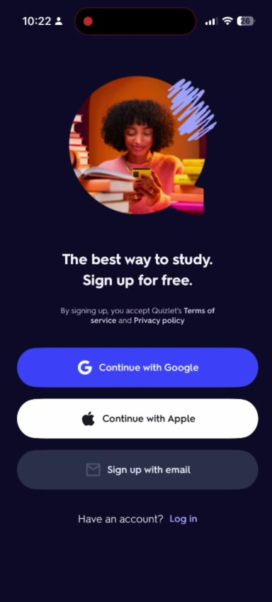
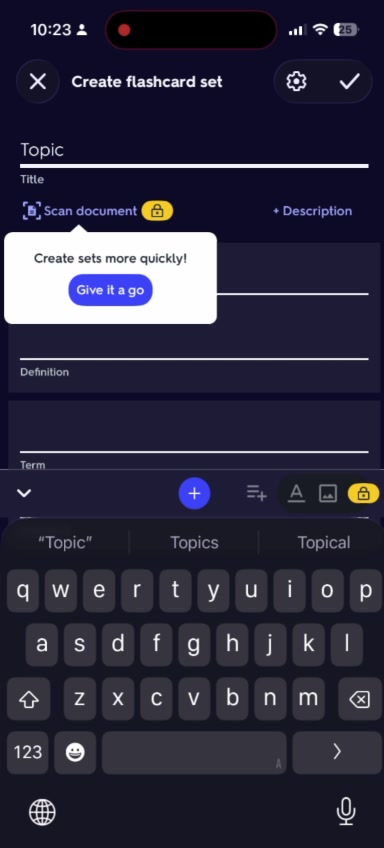
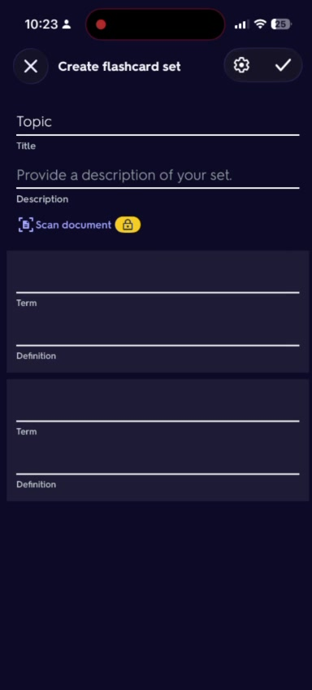
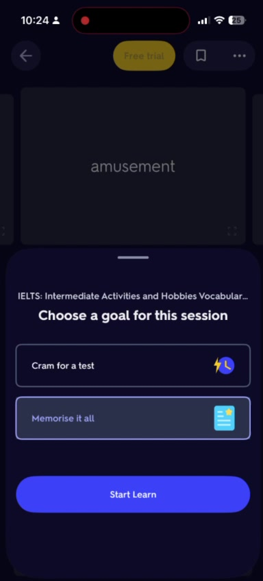

# FlashMind
## iOS Flashcard App - Design Structure
### Liquid Glass UI + AI-First Approach

---

# MVP Features

## Must-Have
- AI-generation from PDF/photo/text
- Spaced repetition (FSRS algorithm)
- Beautiful mobile-first Liquid Glass UI
- Anti-burnout: daily cap, backlog forgiveness
- Basic card types: Q&A, fill-blank
- Freemium model
- iOS Widget for daily cards
- Pre-made popular deck library

## Differentiation Strategy

| Competitor | Our Advantage |
|------------|---------------|
| **vs Anki** | Beautiful Liquid Glass UI, zero config, AI generation |
| **vs Quizlet** | True spaced repetition, affordable pricing |
| **vs Noji** | AI-first approach, modern iOS 26 design |
| **vs Retain/Flash AI** | Better UX, anti-burnout focus |

---

# App Screen Structure

## 1. Onboarding Flow
First impression - clean, inviting, instant value proposition.

### Quizlet Reference:


### Liquid Glass Adaptation:
- Gradient background: deep purple to blue (#1A1A2E to #4A4AFF)
- Glass card container for sign-up options with blur effect
- Frosted glass buttons with subtle glow
- Animated floating cards in background
- Social proof: "Join 1M+ learners" with glass badge

---

## 2. Home Screen
Dashboard with quick actions, daily progress, and personalized recommendations.

### Quizlet Reference:


### Liquid Glass Adaptation:
- Top: Glass streak counter + daily goal progress ring
- "Create flashcards" - prominent glass CTA button
- "Learn questions" - quiz widget with glass container
- "Staff picks" - horizontal scroll with glass cards
- Tab bar: glass morphism with active indicator glow

### Key Components:
- Daily streak widget (glass card with fire emoji)
- Quick actions: Create, Import PDF, Scan Photo
- Continue learning section
- Popular decks carousel

---

## 3. Library Screen
User's collection of decks, folders, and study materials.

### Quizlet Reference:


### Liquid Glass Adaptation:
- Tab pills: "Flashcard sets", "Practice tests", "Folders" in glass style
- Deck cards with glass effect and progress indicator
- Empty state: frosted illustration with "Create your first deck" CTA
- Search bar with glass morphism
- Sort/filter floating action button

### Key Features:
- Grid/list view toggle
- Deck cards show: name, card count, last studied, progress %
- Quick actions: Edit, Share, Delete (swipe)
- Folders for organization

---

## 4. Create Flashcard Screen
AI-powered card creation - the key differentiator.

### Quizlet Reference:



### Liquid Glass Adaptation:
- AI Import section (glass container):
  - "Scan document" with camera icon
  - "Import PDF" with document icon
  - "Paste text" with clipboard icon
- Manual creation: Term/Definition fields with glass styling
- AI suggestion tooltip: "Create sets more quickly!"

### AI Generation Flow:
1. User uploads PDF/photo/text
2. AI extracts key concepts
3. Preview generated cards (editable)
4. Confirm and save deck

---

## 5. Study Session
Core learning experience with spaced repetition.

### Quizlet Reference - Session Goal:


### Quizlet Reference - Quiz Mode:


### Quizlet Reference - Flashcard Mode:


### Liquid Glass Adaptation:
- Session goal selector: "Cram for test" vs "Memorise it all"
- Progress bar with glass effect (1/150)
- Flashcard: large glass card with flip animation
- Quiz mode: glass answer options with hover glow
- Bottom actions: Speaker, Favorite, Undo

### Study Modes:
- **Flashcards** - swipe left/right for know/don't know
- **Quiz** - multiple choice questions
- **Match** - pair terms with definitions
- **Write** - type the answer

### Anti-Burnout Features:
- Daily cap: "Great job! Come back tomorrow"
- Backlog forgiveness: don't punish missed days
- Gentle reminders, not aggressive notifications
- Celebration animations on milestones

---

## 6. iOS Widget
Home screen widget for quick daily review.

### Liquid Glass Adaptation:
- **Small widget**: Today's streak + "Review X cards" button
- **Medium widget**: Daily card preview with flip
- **Large widget**: 3 cards queue + progress
- Glass morphism matching iOS 26 style

---

# Navigation Structure

## Tab Bar (4 tabs)

| Icon | Tab | Purpose |
|------|-----|---------|
| 🏠 | Home | Dashboard, quick actions, recommendations |
| ➕ | Create | Create/import new decks (AI, manual, scan) |
| 📁 | Library | User's decks, folders, progress |
| 🔍 | Explore | Browse pre-made decks, categories |

---

# Liquid Glass Design System

## Color Palette
- **Primary**: #5B4FCF (purple)
- **Secondary**: #4A90D9 (blue)
- **Background**: #0D0D1A to #1A1A2E (dark gradient)
- **Glass fill**: rgba(255, 255, 255, 0.1)
- **Glass border**: rgba(255, 255, 255, 0.2)
- **Success**: #4ADE80 (green)
- **Error**: #F87171 (red)

## Glass Effect Properties
```css
.glass-card {
  background: rgba(255, 255, 255, 0.1);
  backdrop-filter: blur(20px);
  -webkit-backdrop-filter: blur(20px);
  border: 1px solid rgba(255, 255, 255, 0.2);
  border-radius: 20px;
  box-shadow: 0 8px 32px rgba(0, 0, 0, 0.3);
}
```

## Typography
- **Font**: SF Pro Display / SF Pro Text
- **Headings**: Bold, tracking -0.02em
- **Body**: Regular, 16px
- **Caption**: Regular, 14px, 60% opacity

## Animations
- **Card flip**: 0.4s ease-in-out with 3D transform
- **Button press**: scale(0.98) + glow
- **Page transitions**: fade + slide
- **Success**: confetti particles
- **Glass shimmer**: on load

---

# Core User Flows

## Flow 1: First-time User
1. Open app → Onboarding screen
2. Sign up (Google/Apple/Email)
3. Select interests/subjects
4. Home screen with recommended decks
5. Start first study session

## Flow 2: Create AI Deck
1. Tap Create tab
2. Choose: Scan / Import PDF / Paste text
3. AI processes content
4. Preview generated cards
5. Edit/confirm cards
6. Save deck to Library

## Flow 3: Daily Study Session
1. Open app / tap widget
2. See due cards for today
3. Choose goal: "Cram" or "Memorize"
4. Study cards (swipe/quiz)
5. FSRS algorithm schedules next review
6. See progress + streak update

## Flow 4: Browse Pre-made Decks
1. Tap Explore tab
2. Browse categories (Languages, IELTS, Medical...)
3. Preview deck
4. Add to Library
5. Start studying

---

# SwiftUI Implementation Notes

## Key Views Structure
```
FlashMindApp
├── ContentView (TabView)
│   ├── HomeView
│   │   ├── StreakCard
│   │   ├── QuickActionsGrid
│   │   ├── ContinueLearningSection
│   │   └── RecommendedDecksCarousel
│   ├── CreateView
│   │   ├── AIImportSection
│   │   └── ManualCardCreator
│   ├── LibraryView
│   │   ├── DeckGrid/List
│   │   └── FoldersSection
│   └── ExploreView
│       ├── CategoriesGrid
│       └── PopularDecksSection
├── StudySessionView
│   ├── FlashcardView (swipe)
│   ├── QuizView (multiple choice)
│   └── ProgressBar
└── Widgets
    ├── SmallWidget
    ├── MediumWidget
    └── LargeWidget
```

## Glass Card Component
```swift
struct GlassCard<Content: View>: View {
    let content: Content

    var body: some View {
        content
            .background(.ultraThinMaterial)
            .clipShape(RoundedRectangle(cornerRadius: 20))
            .overlay(
                RoundedRectangle(cornerRadius: 20)
                    .stroke(Color.white.opacity(0.2), lineWidth: 1)
            )
            .shadow(color: .black.opacity(0.3), radius: 16, x: 0, y: 8)
    }
}
```

---

*FlashMind - Design Structure v1.0*
