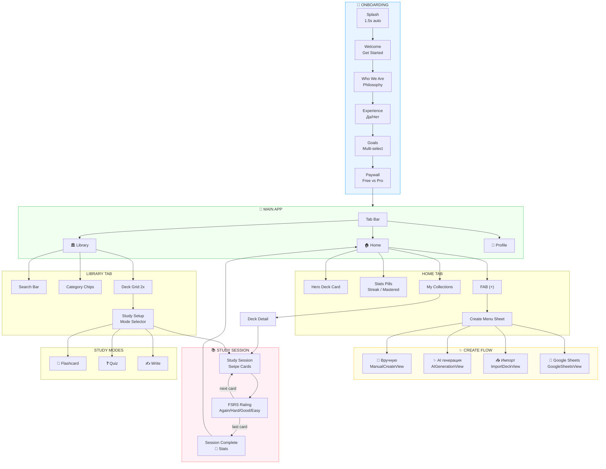

# No Pressure — Screen Flow



---

## Простая текстовая схема

```
┌─────────────────────────────────────────────────────────────────┐
│                         ONBOARDING                               │
│  Splash → Welcome → WhoWeAre → Experience → Goals → Paywall     │
└─────────────────────────────────────────────────────────────────┘
                                │
                                ▼
┌─────────────────────────────────────────────────────────────────┐
│                      MAIN TAB BAR                                │
│                                                                  │
│     🏠 Home          🏛 Library          👤 Profile              │
│        │                 │                   │                   │
│        ▼                 ▼                   ▼                   │
│   ┌─────────┐      ┌──────────┐      ┌───────────┐              │
│   │Hero Card│      │Search    │      │User Info  │              │
│   │Stats    │      │Categories│      │Statistics │              │
│   │My Decks │      │Deck Grid │      │Settings   │              │
│   │FAB (+)  │      └──────────┘      └───────────┘              │
│   └─────────┘                                                    │
└─────────────────────────────────────────────────────────────────┘
        │
        ▼
┌─────────────────────────────────────────────────────────────────┐
│                       CREATE MENU                                │
│                                                                  │
│   📝 Вручную    →  ManualCreateView                             │
│   ✨ AI генерация →  AIGenerationView                           │
│   📥 Импорт     →  ImportDeckView (Anki, Quizlet, CSV)         │
│   🔗 Google Sheets →  GoogleSheetsView                          │
└─────────────────────────────────────────────────────────────────┘

┌─────────────────────────────────────────────────────────────────┐
│                      STUDY SESSION                               │
│                                                                  │
│   Deck Detail → Study Setup → Study Session → Complete          │
│                      │                │                          │
│                      ▼                ▼                          │
│               ┌──────────┐    ┌─────────────┐                   │
│               │Flashcard │    │FSRS Rating  │                   │
│               │Quiz      │    │Again | Hard │                   │
│               │Write     │    │Good  | Easy │                   │
│               └──────────┘    └─────────────┘                   │
└─────────────────────────────────────────────────────────────────┘
```

---

## Переходы (для разработчика)

| Откуда | Действие | Куда | Код |
|--------|----------|------|-----|
| Splash | auto 1.5s | Welcome | `currentScreen = 1` |
| Welcome | tap "Get Started" | WhoWeAre | `currentScreen = 2` |
| Paywall | any CTA | MainTabView | `isOnboardingComplete = true` |
| Home | tap deck row | DeckDetailView | `NavigationLink` |
| Home | tap FAB (+) | CreateMenuSheet | `.sheet(isPresented:)` |
| DeckDetail | tap "Учить" | StudySessionView | `.fullScreenCover` |
| Library | tap deck card | StudySetupView | `NavigationLink` |
| StudySetup | tap "Start" | StudySessionView/Quiz/Write | `navigationDestination` |
| StudySession | rate card | next card / Complete | `rateCard(rating:)` |
| Complete | tap "Return" | Home | `dismiss()` |
